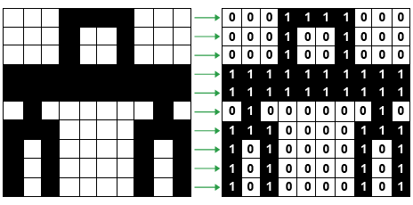

# Representing Text and Images

## Representing data
All data inside a computer is transmitted as a series of electrical signals that are either **on** or **off**. Therefore, in order for a computer to be able to process any kind of data, including text, images and sound, they must be converted into binary form. If the data is not converted into **binary** – a series of 1s and 0s – the computer will simply not understand it or be able to process it.

### Representing text
When any key on a keyboard is pressed, it needs to be converted into a binary number so that it can be processed by the computer and the typed character can appear on the screen.

A code where each number represents a character can be used to convert text into binary. One code we can use for this is called **ASCII**. The ASCII code takes each character on the keyboard and assigns it a binary number. For example:

- the letter ‘a’ has the binary number 0110 0001 (this is the denary number 97)
- the letter ‘b’ has the binary number 0110 0010 (this is the denary number 98)
- the letter ‘c’ has the binary number 0110 0011 (this is the denary number 99)

Text characters start at denary (The number system most commonly used by people. It contains 10 unique digits 0 to 9. Also known as decimal or base 10) number 0 in the ASCII code, but this covers special characters including punctuation, the return key and control characters as well as the number keys, capital letters and lower case letters.

ASCII code can only store 128 characters, which is enough for most words in English but not enough for other languages. If you want to use accents in European languages or larger alphabets such as Cyrillic (the Russian alphabet) and Chinese Mandarin then more characters are needed. Therefore another code, called  <a href="unicode" style="text-decoration: underline;">**Unicode**</a>, was created. This meant that computers could be used by people using different languages.

### Characters and the ASCII Table
  Characters are the basic units used to represent text in computers. They can include letters, digits, punctuation marks, and special symbols. The ASCII (American Standard Code for Information Interchange) encoding scheme is widely used to represent characters in computers. ASCII maps each character to a unique 7-bit binary code, allowing for a total of 128 different characters. The ASCII table serves as a reference that lists the characters in the ASCII encoding scheme along with their corresponding binary codes. It provides a standardized way to represent text characters in digital form. 
  > For example, the character 'A' is represented by the binary code 01000001 in ASCII.

### Unicode
While the ASCII encoding scheme is sufficient for representing characters in the English language, it has limitations when it comes to representing characters from different languages and scripts. To overcome these limitations, Unicode was introduced as a universal character encoding standard. Unicode provides a comprehensive solution for representing characters from various languages, scripts, and symbols worldwide. Unicode expands character representation by using either 16 bits (UTF-16) or 32 bits (UTF-32) to encode characters. This allows for the inclusion of a vast range of characters, including emojis, special symbols, and characters from different writing systems. Unicode supports multilingual text representation and facilitates global communication and interoperability.

Unicode not only supports characters from different scripts but also provides mechanisms to handle complex text rendering, combining characters, bidirectional text, and text segmentation. It ensures that text can be correctly displayed and processed across different platforms, devices, and software applications. Unicode has become the de facto standard for character encoding and plays a vital role in internationalization and localization efforts.

### Representing Colors
Colors in digital systems are typically represented using the **RGB** (Red, Green, Blue) color model. This model combines different intensities of red, green, and blue to create a wide spectrum of colors. In the RGB color model, each color component is represented by an 8-bit value, ranging from 0 to 255. By combining different intensities of these three primary colors, a wide range of colors can be achieved. For example, RGB values (255, 0, 0) represent full intensity red, (0, 255, 0) represents full intensity green, and (0, 0, 255) represents full intensity blue.

Color depth, also known as bit depth, refers to the number of bits used to represent each color component. Higher color depth allows for more precise color representation and a larger number of possible colors. For example, 24-bit color depth (8 bits per color channel) can represent over 16 million colors. With advancements in technology, higher color depths such as 32-bit and 48-bit are becoming more common, enabling even more accurate color reproduction.

### Images as Maps of Colored Pixels
Images in digital systems are composed of a grid of individual picture elements called pixels. Each pixel represents a specific color or intensity value. Pixel-based image representation allows for precise control over the appearance of an image by manipulating the colors or intensities of individual pixels.

The resolution of an image refers to the number of pixels in the horizontal and vertical dimensions. Higher resolution images contain more pixels, resulting in greater detail and clarity. Resolution is often measured in terms of pixels per inch (PPI) or dots per inch (DPI) and affects the level of detail and sharpness that can be perceived in an image. Higher-resolution images are generally preferred in applications such as printing, where fine details need to be preserved.

To understand how pictures can be stored in memory as grid of pixels here is some simplified example where image is represented as a map of white and black pixels.

> Understanding how text and images are represented in computer systems is essential in computer architecture. It provides the foundation for effective communication, data storage, and multimedia applications. The concepts of characters, character encoding schemes like ASCII and Unicode, color representation using the RGB model, and pixel-based image representation are fundamental in this domain.
