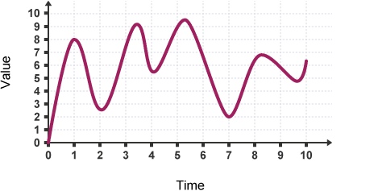
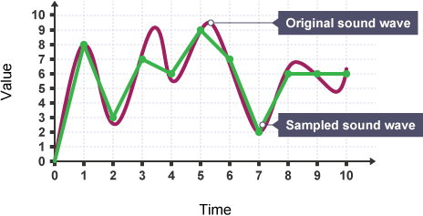

# GPU: Graphics Processing Unit

### What is a GPU?

A GPU, which stands for Graphics Processing Unit, is a specialized electronic circuit that is designed to accelerate the creation and rendering of images, videos, and graphics. While CPUs (Central Processing Units) are general-purpose processors that handle a wide range of tasks, GPUs are specifically optimized for parallel processing and are particularly efficient at performing complex mathematical calculations required for graphics rendering.

### Computer Graphics

Computer graphics is a field that focuses on creating, manipulating, and displaying visual content using computers. It involves various techniques and algorithms to generate and render images, animations, and interactive graphics. GPUs play a crucial role in computer graphics by performing the intensive calculations required for rendering high-quality graphics and achieving real-time interactivity.

For example, in video games, GPUs are responsible for rendering 3D environments, characters, and special effects. They calculate lighting and shading effects, simulate physics-based interactions, and apply textures to surfaces, resulting in realistic and immersive gaming experiences.

In the film industry, GPUs are used in the creation of visual effects (VFX) and computer-generated imagery (CGI). They enable the rendering of lifelike characters and environments, the simulation of realistic physics, and the generation of complex particle systems.

### Storing Pixels in Memory

Images in digital systems are composed of a grid of individual picture elements called pixels. Each pixel represents a specific color or intensity value. To store these pixels in memory, various formats and color models are used.

The most common format for storing pixel data is the RGB (Red, Green, Blue) color model. In this model, each pixel is represented by three color components: red, green, and blue. Each color component is typically represented by an 8-bit value, ranging from 0 to 255. By combining different intensities of these three primary colors, a wide range of colors can be achieved.

Pixels are stored in memory in a linear fashion, row by row. The memory is organized in a way that each row of pixels is stored consecutively, and the rows themselves are also stored consecutively. This arrangement allows for efficient retrieval and manipulation of pixel data during rendering and processing operations.

### Why is GPU Used when there is CPU?

The CPU and GPU have different strengths and purposes. CPUs are designed to handle a variety of tasks, including running operating systems, executing programs, and managing system resources. They are optimized for sequential processing and perform well with single-threaded tasks that require complex decision-making and control flow.

On the other hand, GPUs excel at parallel processing, which means they can perform multiple calculations simultaneously. This makes them highly efficient at handling large amounts of data simultaneously, which is crucial for graphics-intensive applications such as gaming, video editing, and 3D rendering. By offloading the graphics processing tasks to the GPU, the CPU is freed up to handle other important system operations, resulting in improved performance and responsiveness.

In short GPU is used to handle graphical data, which sometimes can be much enough, and to make CPU work on other instructions.

## GPU Applications in Video data
Videos are stored as a collection of frames, where each frame represents an individual image within the video. Similar to images, videos can be seen as a 2D grid or map of pixels arranged in rows and columns. Each pixel within a frame holds color or intensity information that contributes to the visual representation of the video.

To create the illusion of motion, videos play back a sequence of frames at a specific rate called the frame rate. The frame rate determines how many frames are displayed per second. For instance, a video with a frame rate of 30 frames per second (FPS) will show 30 frames in succession every second, resulting in smooth motion.

Video compression techniques are employed to reduce the storage space required for videos. These techniques take advantage of the fact that consecutive frames in a video often exhibit similarities or subtle differences. Instead of storing each frame independently, video compression algorithms encode the differences between frames or utilize other strategies to efficiently represent the video data.

One widely used video compression standard is H.264 (also known as AVC). It incorporates temporal compression by analyzing consecutive frames and encoding only the variations between them. Spatial compression is also employed, leveraging redundancy within each frame to further reduce file size.

By representing videos as a sequence of frames and applying compression techniques, video data can be stored, transmitted, and played back efficiently. This allows for smooth motion and high-quality visual content while optimizing storage space and transmission bandwidth.

### FPS: Frames Per Second

FPS, or Frames Per Second, is a measurement used to determine the smoothness of motion in videos, animations, and games. It represents the number of frames, or individual images, that are displayed or rendered per second. The higher the FPS, the smoother the motion appears to the viewer.

For example, a video game running at 60 FPS will appear much smoother and more fluid compared to the same game running at 30 FPS. The GPU plays a vital role in achieving high FPS by rendering and displaying a large number of frames quickly and efficiently.

## GPU Applications in Audio Data

Although GPUs are primarily known for their role in graphics processing, they can also be used for audio data processing. GPUs' parallel processing capabilities can accelerate audio tasks such as audio effects, real-time audio synthesis, and audio analysis.

For example, GPU-accelerated audio plugins can apply complex effects to audio signals in real-time, such as reverb, delay, and equalization. Additionally, GPU-based audio synthesis algorithms can generate complex waveforms and modulations with high precision and efficiency.

### Representing sound
Sound needs to be converted into binary for computers to be able to process it. To do this, sound is captured - usually by a microphone - and then converted into a digital signal.

An analogue to digital converter will sample a sound wave at regular time intervals. For example, a sound wave like this can be sampled at each time sample point:

The samples can then be converted to binary. They will be recorded to the nearest whole number.

| Time sample | 1    | 2    | 3    | 4    | 5    | 6    | 7    | 8    | 9    | 10   |
|-------------|------|------|------|------|------|------|------|------|------|------|
| Denary      | 8    | 3    | 7    | 6    | 9    | 7    | 2    | 6    | 6    | 6    |
| Binary      | 1000 | 0011 | 0111 | 0110 | 1001 | 0111 | 0010 | 0100 | 0110 | 0110 |

If the time samples are then plotted back onto the same graph, it can be seen that the sound wave now looks different. This is because sampling does not take into account what the sound wave is doing in between each time sample.

This means that the sound loses quality as data has been lost between the time samples. The way to increase the quality and store the sound at a quality closer to the original, is to have more time samples that are closer together. This way, more detail about the sound can be collected, so when it’s converted to digital and back to analogue again it does not lose as much quality.

The frequency at which samples are taken is called the **sample rate**, and is measured in Hertz (Hz). 1 Hz is one sample per second. Most CD-quality audio is sampled at 44 100 or 48 000 KHz.

## Compression

#### Why compress files?

Processing power and storage space is very valuable on a computer. To get the best out of both, it can mean that we need to reduce the file size of text, image and audio **data** in order to transfer it more quickly and so that it takes up less storage space.

In addition, large files take a lot longer to **download** or **upload** which leads to web pages, songs and videos that take longer to load and play when using the internet.

**Compression** addresses these issues.

Any kind of data can be compressed. There are two main types of compression: **lossy** and **lossless**.

#### Lossy compression
Lossy compression removes some of a file’s original data in order to reduce the file size. This might mean reducing the numbers of colours in an image or reducing the number of samples in a sound file. This can result in a small loss of quality of an image or sound file.

A popular lossy compression method for images is the **JPEG**, which is why most images on the internet are JPEG images. A popular lossy compression method for sounds is **MP3**. **Once a file has been compressed using lossy compression, the discarded data cannot be retrieved again.**

#### Lossless compression
Lossless compression doesn’t reduce the quality of the file at all. No data is lost, so lossless compression allows a file to be recreated exactly as it was when originally created.

There are various algorithms for doing this, usually by looking for patterns in the data that are repeated. **Zip** files are an example of lossless compression.

The space savings of lossless compression are not as good as they are with lossy compression.

> In conclusion, GPUs are specialized processors designed to accelerate graphics rendering and image processing tasks. They excel at parallel processing, making them ideal for handling complex mathematical calculations required for graphics-intensive applications. Additionally, GPUs can contribute to audio processing tasks, enhancing the performance and capabilities of audio applications. Understanding the strengths and purposes of CPUs and GPUs helps optimize the utilization of computing resources and achieve better performance in various applications, including computer graphics.
