# Boolean Algebra

Boolean algebra is the category of algebra in which the variable's values are the truth values, true and false, ordinarily denoted 1 and 0 respectively. Boolean Algebra is used to analyze and simplify the digital (logic) circuits. The concepts and operations of Boolean algebra were first introduced by George Boole in 1854. The primary objective of Boolean algebra is to manipulate logical expressions, expressed as combinations of variables and logical operators, to obtain simplified and more manageable forms. 

## Logic Operators

The fundamental operations performed in Boolean algebra are the logical AND (&&), OR (||), NOT (!) and XOR (^) operations. These operations enable the evaluation of complex logical expressions by combining or negating variables based on their truth values.

### NOT Operator

The NOT operator is a unary operator that takes a single Boolean operand and produces the opposite value. It negates or flips the Boolean value. That is, it produces true if the operand evaluates to false, and false if the operand evaluates to true.

| x        | not x  |
| -------- | ----   |
| false    | true   |
| true     | false  |

### AND Operator

The AND operator is a binary operator that takes two Boolean operands and produces true if both operands are true; otherwise, it produces false. The result of `x && y` is true if both `x` and `y` evaluate to true. Otherwise, the result is false.

| x        | y        | x and y  |
| -------- | -------- | -------- |
| false    | false    | false    |
| false    | true     | false    |
| true     | false    | false    |
| true     | true     | true     |

### OR Operator

The OR operator is a binary operator that takes two Boolean operands and produces true if at least one of the operands is true; otherwise, it produces false. The result of `x || y` is true if either `x` or `y` evaluates to true. Otherwise, the result is false.

| x        | y        | x or y   |
| -------- | -------- | -------- |
| false    | false    | false    |
| false    | true     | true     |
| true     | false    | true     |
| true     | true     | true     |

### XOR Operator

The XOR (Exclusive OR) operator is a binary logical operator that returns true if and only if the two operands have different boolean values. Here are the properties and truth table for the XOR operator:

| x        | y        | x xor y  |
| -------- | -------- | -------- |
| false    | false    | false    |
| false    | true     | true     |
| true     | false    | true     |
| true     | true     | false    |

# Electric Circuits

An electric circuit refers to a path or network of interconnected electrical components through which electric current can flow.

## Components of an Electric Circuit

- Power Source: The power source, such as a battery or generator, provides the electrical energy necessary to drive the current through the circuit.
- Conductors: Conductors are materials that allow the flow of electric current.
- Resistors: Resistors are passive components that introduce resistance to the flow of current. They are used to control the current and voltage levels within a circuit.
- Capacitors: Capacitors store electrical energy in an electric field. They are used to store and release electrical charge in circuits.
- Inductors: Inductors store electrical energy in a magnetic field.
- Diodes: Diodes are semiconductor devices that allow current to flow in one direction while blocking it in the opposite direction.
- Transistors: Transistors are active electronic components that can amplify and switch electrical signals.

## Types of Electric Circuits

- Series Circuit: In a series circuit, the components are connected in a sequence, forming a single path for the current to flow. The current remains the same throughout the circuit, while the voltage divides among the components.
- Parallel Circuit: In a parallel circuit, the components are connected such that there are multiple paths for the current to flow. The voltage remains the same across all components, while the current divides among the branches.
- Combination Circuit: A combination circuit is a mix of series and parallel circuits. It contains both series and parallel connections, allowing for complex circuit configurations.

# The Connection between Boolean Algebra Operations and Electric Circuits

Claude Shannon showed how to represent logical operations using electrical switches and circuits. Shannon developed the concept of truth tables, which provide a systematic way to represent the output of a Boolean function for all possible input combinations. Truth tables are used to analyze and design digital circuits, enabling the prediction of circuit behavior and optimization.

Boolean algebra provides a mathematical framework for analyzing and manipulating logical expressions, while electric circuits serve as the physical implementation of these logical operations.

## Experiment: Connecting a Light Bulb and Battery with Two Switches

To begin the experiment, you connect a light bulb and a battery as you would normally, but instead of using just one switch, you use two switches:

- Switch 1: Represents a Boolean variable, such as `A`.
- Switch 2: Represents another Boolean variable, such as `B`.

By manipulating the positions of the switches, you can control the flow of electric current in the circuit and observe the behavior of the light bulb.

For example, if both switches are closed (ON), it represents a logical AND operation (`A AND B`), where the light bulb will only light up if both `A` and `B` are true (connected to the battery).

This experiment demonstrates how electric circuits can be used to implement Boolean algebra operations, allowing us to observe and experiment with logical concepts in a tangible and practical manner.

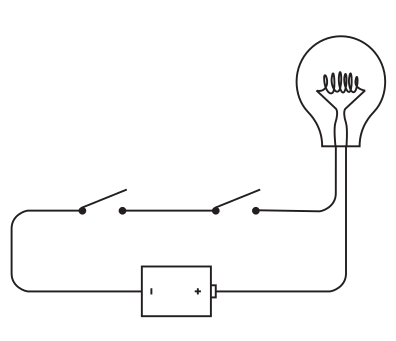

Switches connected in this way—one right after the other—are said to be wired in series. If you close the left switch, nothing happens:

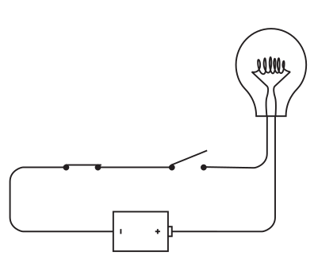

 Similarly, if you leave the left switch open and close the right switch, nothing happens. The lightbulb lights up only if both the left switch and the right switch are closed:

 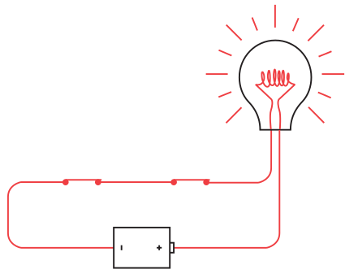

The key word here is "and". Both the left switch and the right switch must be closed for the current to flow through the circuit. We can summarize the workings of this circuit in the following table:

| Left Switch | Right Switch | Lightbulb |
|-------------|--------------|-----------|
|    Open     |     Open     | not lit   |
|    Open     |    Closed    | not lit   |
|   Closed    |     Open     | not lit   |
|   Closed    |    Closed    |   lit     |

A lightbulb has two states; hence it too can represent a bit. We can say that a 0 means "lightbulb is not lit" and a 1 means "lightbulb is lit." Now we simply rewrite the table:

| Left Switch | Right Switch | Lightbulb |
|-------------|--------------|-----------|
|     0       |     0        |     0     |
|     0       |     1        |     0     |
|     1       |     0        |     0     |
|     1       |     1        |     1     |

Now try connecting the two switches a little differently:

 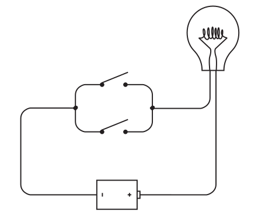

These switches are said to be connected in parallel. The difference between this and the preceding connection is that this lightbulb will light if you close the top switch:

 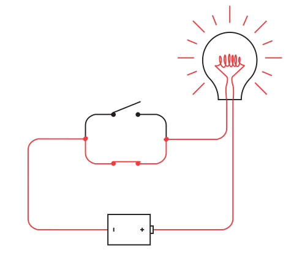

or close the bottom switch:

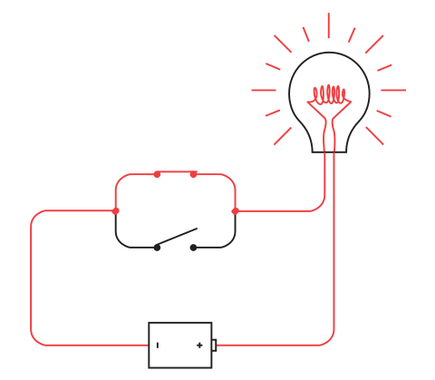

or close both switches:

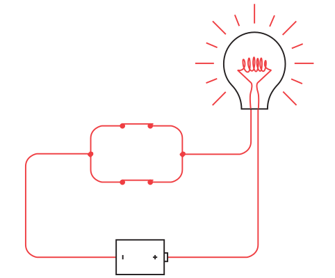

The lightbulb lights if the top switch or the bottom switch is closed. The key word here is or.

The following table summarizes how this circuit works:

| Left Switch | Right Switch | Lightbulb |
|-------------|--------------|-----------|
|    Open     |     Open     |  not lit  |
|    Open     |    Closed    |   lit     |
|   Closed    |     Open     |   lit     |
|   Closed    |    Closed    |   lit     |

Again, using 0 to mean an open switch or an unlit lightbulb and 1 to mean a closed switch or a lit lightbulb, this table can be rewritten this way:

| Left Switch | Right Switch | Lightbulb |
|-------------|--------------|-----------|
|     0       |     0        |     0     |
|     0       |     1        |     1     |
|     1       |     0        |     1     |
|     1       |     1        |     1     |

Actually, the lightbulb can be connected to the relay in two ways. Notice the flexible metal piece that’s pulled by the electromagnet. At rest, it’s touch- ing one contact; when the electromagnet pulls it, it hits another contact. We’ve been using that lower contact as the output of the relay, but we could just as well use the upper contact. When we use this contact, the output of the relay is reversed and the lightbulb is on when the input switch is open:

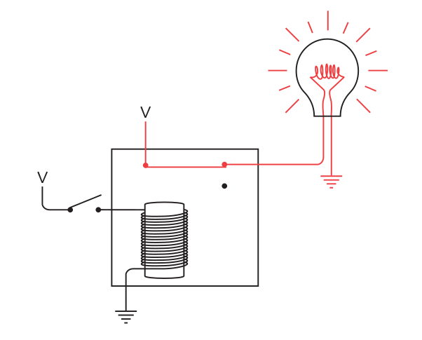

And when the input switch is closed, the bulb goes out:

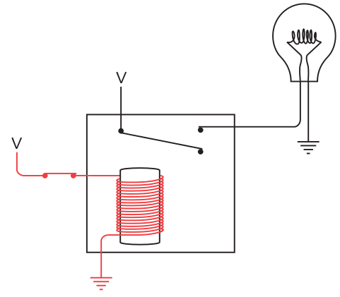

The lightbulb lights if  switch is open. The key word here is not.

The following table summarizes how this circuit works:

|  Switch     | Lightbulb |
|-------------|-----------|
|    Open     |  lit      |
|   Closed    |  not lit  |

Again, using 0 to mean an open switch or an unlit lightbulb and 1 to mean a closed switch or a lit lightbulb, this table can be rewritten this way:

| Left Switch | Lightbulb |
|-------------|-----------|
|     0       |     1     |
|     1       |     0     |

# Logic Gates

A gate can be defined as a digital circuit that can allow a signal (electric current) to pass or stop. A logic gate is an electronic circuit element that performs a specific Boolean logic operation on one or more binary input signals and produces a corresponding output signal. It is an electronic circuit having one or more than one input and only one output.

There are several types of logic gates, each corresponding to a specific Boolean operation. Here are some common types of logic gates:

## AND Gate
An AND gate has two or more inputs and produces an output that is true (1) only when all of its inputs are true; otherwise, it gives false (0).

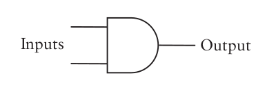

## OR Gate
An OR gate also has two or more inputs and produces an output that is true (1) if at least one of its inputs is true; otherwise, it gives false (0).

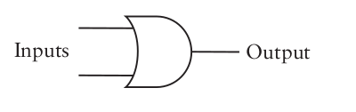

## NOT Gate
A NOT gate, also known as an inverter, has a single input and produces the logical negation of that input as the output. The NOT gate gives an output of 1 if the input is 0 and vice versa.

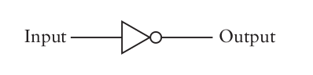

## XOR Gate

XOR Gate: A XOR gate takes two inputs and produces an output that is true (1) if the inputs differ, and false (0) if the inputs are the same. 

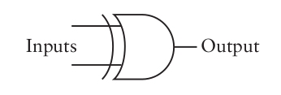

# Truth Tables

A truth table is a table that displays all possible combinations of input values for a logical expression or function, along with the corresponding output values. It provides a systematic way to enumerate and organize the truth values of a logical expression based on the different possible combinations of truth values for its variables. In a truth table, each column represents an input variable or a combination of input variables, and the final column represents the output value(s) of the expression. The number of rows in the truth table is determined by the number of possible combinations of truth values for the input variables.

## AND Gate Truth Table

| Input A | Input B | Output |
|---------|---------|--------|
|   0     |   0     |   0    |
|   0     |   1     |   0    |
|   1     |   0     |   0    |
|   1     |   1     |   1    |

## OR Gate Truth Table

| Input A | Input B | Output |
|---------|---------|--------|
|   0     |   0     |   0    |
|   0     |   1     |   1    |
|   1     |   0     |   1    |
|   1     |   1     |   1    |

## NOT Gate Truth Table

| Input | Output |
|-------|--------|
|   0   |   1    |
|   1   |   0    |

## XOR Gate Truth Table

| Input A | Input B | Output |
|---------|---------|--------|
|   0     |   0     |   0    |
|   0     |   1     |   1    |
|   1     |   0     |   1    |
|   1     |   1     |   0    |
