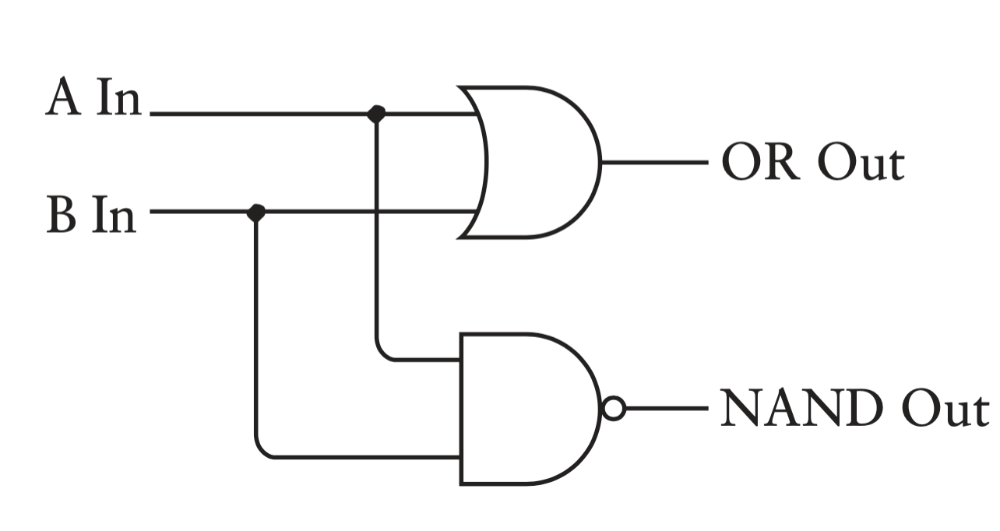
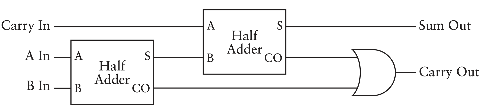
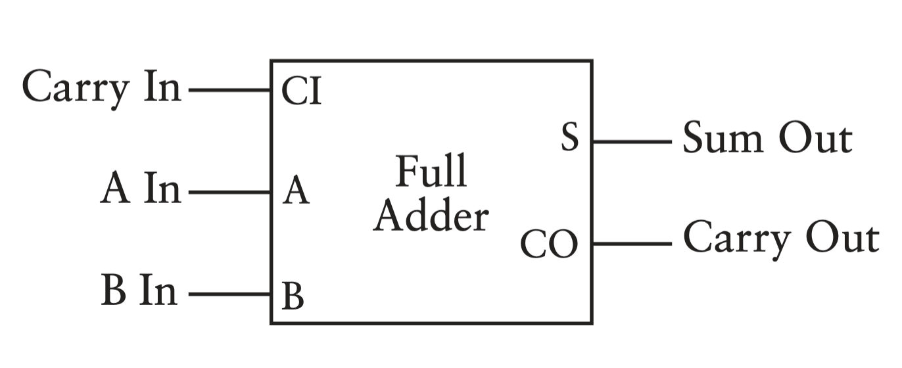

# Lesson 6 - Designing a 4-bit Adder and Subtractor

## Addition

Addition is a fundamental arithmetic operation that serves as the building block for computer systems. To construct a computer, it is crucial to understand how to create a mechanism that can add two numbers together.

When adding decimal numbers, we typically rely on a more complex addition table that accounts for all possible combinations of digits from 0 to 9. However, when adding binary numbers, we only need a much simpler table that accounts for the two possible digits: 0 and 1. This binary addition table is easier to memorize and work with, as it has fewer entries and simpler rules for combining the digits.

| + | 0 | 1 |
| :---        |    :----:   |          ---: |
| 0 | 0 | 1 |
| 1 | 1 | 10 |

*0 plus 0 equals 0.*

*0 plus 1 equals 1.*

*1 plus 0 equals 1.*

*1 plus 1 equals 0, carry the 1.*

We add two binary numbers column by column beginning with the rightmost column:

 01100101

+  10110110

100011011
 

There is a connection between logic gates and binary addition. Let's look at the table of the carry bit:
| carry | 0 | 1 |
| :---        |    :----:   |          ---: |
| 0 | 0 | 0 |
| 1 | 0 | 1 |

This is the identical to the output of the **AND** gate: 
| AND | 0 | 1 |
| :---        |    :----:   |          ---: |
| 0 | 0 | 0 |
| 1 | 0 | 1 |

Next for the sum bit which turns out to be not quite straightforward as the carry bit: 
| +sum | 0 | 1 |
| :---        |    :----:   |          ---: |
| 0 | 0 | 0 |
| 1 | 1 | 0 |

**OR** and **NAND** logic gates are close what we want to except for sum bit case. So let's connect both an **OR** gate and **NAND** to the same inputs:

This circuit called the **Exclusive OR** or **XOR** gate. And finally, instead of drawing **AND** and **OR** gates we can simply draw a box which is labeled *Half Adder*. It adds two binary digits and gives a sum bit and carry bit. 

The Half Adder, although useful for adding two binary numbers, does not account for the inclusion of a carry bit from a previous addition. Suppose we want to add the binary numbers 101 and 110. In this case, the addition of the rightmost column (1 + 0) can be handled by a Half Adder, resulting in a sum of 1 and no carry. However, when we move to the second column from the right, we encounter a carry from the previous column (represented as 1).

101

+ 110

1011
 

To handle this situation, we use two **Half Adders** and an **OR** gate.

Here's how the process works: 
<ul>
  <li>The first Half Adder takes the two bits from the second column (0 and 1) as inputs and produces a sum of 1 and a carry of 0.</li>
  <li>The second Half Adder takes the carry from the previous column (1) and the remaining bit from the second column (0) as inputs. It produces a sum of 1 and a carry of 1.</li>
  <li>The OR gate takes the two carry outputs from the Half Adders and produces the final carry of 1.</li>
</ul>

By combining the results from the two **Half Adders** and the **OR** gate, we can accurately add three binary numbers. And instead of drawing that diagram, we can just call it *Full Adder*: 

