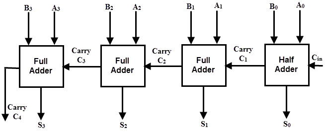

# Lesson 6 - Designing a 4-bit Adder and Subtractor

## Addition

The process of addition is a fundamental arithmetic operation that forms the foundation of computer systems. In order to build a computer, it is essential to comprehend the creation of a mechanism capable of combining two numbers.

When we perform addition with decimal numbers, we typically rely on a more intricate addition table that incorporates all conceivable combinations of digits ranging from 0 to 9. However, when adding binary numbers, a much simpler table suffices, considering there are only two possible digits: 0 and 1. Memorizing and working with this binary addition table is easier due to its reduced number of entries and simpler rules for combining the digits.

|   +   |  0  |  1  |
|:-----:|:---:|:---:|
|   0   |  0  |  1  |
|   1   |  1  | 10  |

*0 plus 0 equals 0.*

*0 plus 1 equals 1.*

*1 plus 0 equals 1.*

*1 plus 1 equals 0, carry the 1.*

We add two binary numbers column by column beginning with the rightmost column:

 01100101

+  10110110

100011011
 

There is a connection between logic gates and binary addition. Let's look at the table of the carry bit:
| carry |  0  |  1  |
|:-----:|:---:|:---:|
|   0   |  0  |  0  |
|   1   |  0  |  1  |

This is the identical to the output of the **AND** gate: 
| AND |  0  |  1  |
|:---:|:---:|:---:|
|  0  |  0  |  0  |
|  1  |  0  |  1  |

Next for the sum bit which turns out to be not quite straightforward as the carry bit: 
| +sum |  0  |  1  |
|:----:|:---:|:---:|
|   0  |  0  |  0  |
|   1  |  1  |  0  |

**OR** and **NAND** logic gates are close what we want to except for sum bit case. So let's connect both an **OR** gate and **NAND** to the same inputs:

This circuit called the **Exclusive OR** or **XOR** gate. And finally, instead of drawing **AND** and **OR** gates we can simply draw a box which is labeled *Half Adder*. It adds two binary digits and gives a sum bit and carry bit. 

The Half Adder, although useful for adding two binary numbers, does not account for the inclusion of a carry bit from a previous addition. Suppose we want to add the binary numbers 101 and 110. In this case, the addition of the rightmost column (1 + 0) can be handled by a Half Adder, resulting in a sum of 1 and no carry. However, when we move to the second column from the right, we encounter a carry from the previous column (represented as 1).

101

+ 110

1011
 

To handle this situation, we use two **Half Adders** and an **OR** gate.

Here's how the process works: 
<ul>
  <li>The first Half Adder takes the two bits from the second column (0 and 1) as inputs and produces a sum of 1 and a carry of 0.</li>
  <li>The second Half Adder takes the carry from the previous column (1) and the remaining bit from the second column (0) as inputs. It produces a sum of 1 and a carry of 1.</li>
  <li>The OR gate takes the two carry outputs from the Half Adders and produces the final carry of 1.</li>
</ul>

By combining the results from the two **Half Adders** and the **OR** gate, we can accurately add three binary numbers. And instead of drawing that diagram, we can just call it *Full Adder*: 

Here's a table representing the truth table for a Full Adder, which combines two Half Adders and an OR gate to accurately add three binary numbers:
|  A  |  B  | Cin | Sum | Cout |
|:---:|:---:|:---:|:---:|:----:|
|  0  |  0  |  0  |  0  |   0  |
|  0  |  0  |  1  |  1  |   0  |
|  0  |  1  |  0  |  1  |   0  |
|  0  |  1  |  1  |  0  |   1  |
|  1  |  0  |  0  |  1  |   0  |
|  1  |  0  |  1  |  0  |   1  |
|  1  |  1  |  0  |  0  |   1  |
|  1  |  1  |  1  |  1  |   1  |

In this table, the inputs A and B represent the two bits being added, while Cin represents the carry input from the previous column. The outputs Sum represent the sum bit for the current column, and Cout represents the carry output to the next column. By evaluating the inputs A, B, and Cin according to this truth table, we can determine the corresponding outputs Sum and Cout, allowing us to accurately add three binary numbers using the Full Adder.

## 4-bit Adder 

The table that we provided represents a truth table for a 1-bit adder. To present a 4-bit adder, we would need to extand the structure to include inputs and outputs for each bit position(A[3:0], B[3:0]), their corresponding sum bits (S[3:0]) and carry-out(C[3:0]).

 The 4-bit Binary Adder is illustrated in the diagram below consists of three full adders and one half adder. The input of each full adder receives the corresponding bits 'A3 A2 A1 A0' and 'B3 B2 B1 B0', representing the two binary numbers to be added. The output of the adder is denoted as 'C4 S3 S2 S1 S0', with 'C4' representing the final carry and 'S3 S2 S1 S0' representing the resulting sum. The initial component is a half-adder that takes A0 and B0 as inputs and generates a sum output S0 along with a carry bit C1. Alternatively, the first component can be a full adder, but in that case, the input carry C0 must be set to 0. The subsequent three components in the adder are full adders, as they receive three inputs each. These inputs include two primary binary bits and a carry bit from the preceding stage. 

## Subtraction 

Although addition and subtraction have some similarities, they operate in different ways. From the rightmost digit column to the leftmost column, addition proceeds progressively. The following column receives each carry from the previous one. We do not carry digits in subtraction like we do in addition. Instead, we use a fundamentally different approach to borrow from higher digits. In comparison to addition, this borrowing process can be thought of as an ongoing cycle that builds complexity. Let's perform the action shown in the figure.

345

- 178

167
 

We start with the rightmost column to accomplish this. First, we observe that 8 is larger than 5, thus we must borrow 1 from 4 before deducting 8 from 15 to arrive at 7. Then, we must keep in mind that we subtracted 1 from the 4, making the result really a 3, which is smaller than 7, so we borrow 1 from the 3, subtracting 7 from 13, which equals 6, and continuing. Then we must keep in mind that we borrowed 1 from the 3, making it actually a 2, from which we deduct 1 to get 1. Our response is 178.

Applying a similar approach using logic gates would be very complicated and unclear.Instead, we are going to use a little trick that lets us subtract without borrowing. We must make reference to the two numbers being subtracted in order to explain this. The minuend and the subtrahend are their formal names. The difference is calculated by subtracting the subtrahend from the minuend.

Minuend

- Subtrahend

Difference
 

To subtract without borrowing, we first subtract the **subtrahend** not from the **minuend** but from 999:

999

- 178

821
 

Since the numbers have three digits, we use 999. We would use 9999 if the numbers were 4 digits instead. The nines' complement is the result of deducting a number from a string of nines. The complement of the nines, 178, is 821. It also operates in reverse: There are 178 nines in the complement of 821. What's nice is that calculating the nines' completion never necessitates borrowing, regardless of the subtrahend. After we've calculated nines' complement of the subtrahend, we add it to original minuend: 

345

+ 821

1166
 

And finally we add 1 and subract 1000: 

1166

+ &emsp;&ensp;1

- 1000

167
 

The result is the same as before when we made with borrow. The expression can have any number added to and subtracted from it, and the outcome will always be the same. So let's add 1000 subtract 1000:

"345 - 178 + 1000 - 1000" this expression is equivalent to "345 + (999 - 178) + 1 - 1000".
The operations with binary numbers are the same as we did with decimal. 

101011001

- 10110010

10100111
 

As in decimal subtraction, we can do the subtrahend from 111111111 (which equals 511): 

111111111

- 10110010

101001101
 

When dealing with decimal numbers, we used to subtract the subtrahend from a sequence of nines, resulting in what was known as the nines' complement. In the case of binary numbers, the subtrahend is subtracted from a sequence of ones, yielding the ones' complement. Interestingly, calculating the ones' complement doesn't necessarily require performing an actual subtraction operation. This is because every 0 bit in the original number transforms into a 1 bit in the ones' complement, while every 1 bit converts to a 0 bit. Consequently, the ones' complement is sometimes referred to as the negation or the inverse. 

Second step: we should add the ones' complement of the subtrahend to minuend: 

101011001

+ 101001101

1010100110
 

Third step: add 1 to the result 

1010100110

+ &emsp;&emsp;&emsp;&emsp;&ensp; 1

1010100111
 

Last step: subtract 111111111 (which equals 511):

1010100111

- 100000000

10100111
 

The result is equivalent to 167 in decimal.(notice that this time a 0 is added to the beginning of the minuend). 

Similar to the adder circuits, basic substraction circuits are also of two types:
<ul>
  <li>Half Subtractor</li>
  <li>Full Subtractor</li>
</ul>

A Half Subtractor is a type of logic circuit used for subtracting two 1-bit binary numbers. It has two inputs and two outputs. The inputs represent the two 1-bit binary numbers being subtracted, while the outputs represent the resulting difference and borrow. This is in contrast to a Half Adder, which produces a sum and carry output.

The table below displays the truth table for a Half Subtractor. 

  <table>
    <tbody>
      <tr >
        <td colspan=2 style="text-align: center; width: 150px" >
          <strong>Input</strong>
        </td>
        <td colspan=2 style="text-align: center; width: 150px">
          <strong>Output</strong>
        </td>
      </tr>
      <tr>
        <td style="text-align: center; width: 75px">
          <strong>A</strong>
        </td>
        <td style="text-align: center; width: 75px">
          <strong>B</strong>
        </td>
        <td style="text-align: center; width: 75px">
          <strong>Difference</strong>
        </td>
        <td style="text-align: center; width: 75px">
          <strong>Borrow</strong>
        </td>
      </tr>
    </tbody>
  </table>

